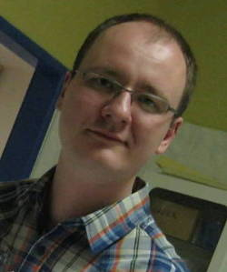
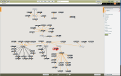

= Jozef Wagner
:icons: font

Business Consultant, Experienced Software Engineer

[.float-group]
--

[.text-justify]
I solve business problems and create additional value for my clients.
My name is Jozef Wagner and my expertise as a
<<Consulting Services,business consultant>> lies in *creating software
that is tailored to meet individual business needs*.
With more than 10 years of <<Experience,professional experience>>,
I deliver solutions that generate revenue, have low total cost of
ownership, and are flexible when adopting to new business strategies
and initiatives.

[.text-justify]
I specialize in addressing business needs with the application
of techniques from the field of data mining, business intelligence and
machine learning. I will help you to reduce risks and maintain trust
in your products, processes, and business critical systems.
I will also aid you in making better and more informed decisions.

[.text-center]
Software Development &nbsp; &#x2022; &nbsp; Business Intelligence &nbsp; &#x2022; &nbsp; <<Open Source Projects,Clojure Specialist>>
--

icon:pencil[] http://blog.wagjo.com[Blog] &nbsp; icon:github[] http://github.com/wagjo[Github] &nbsp; icon:twitter[] https://twitter.com/wagjo[@wagjo] &nbsp; icon:linkedin[] https://sk.linkedin.com/in/jozefwagner[jozefwagner] &nbsp; icon:phone[] +421 949 213 889 &nbsp; icon:envelope-o[] wagjo@wagjo.com

== Experience

* Implemented and deployed backend services that collect and process
large amount of streaming geolocalized content, providing input for a
data analytics platform for urban design, city planning and urban
management market.

* Contributed to the middleware services for innovative data-driven
analytics platform for a multinational information design agency,
which enabled company to provide a new group of services and generate
 additional revenue.

* Designed and implemented software solution that allowed company to
introduce new product for the medical and chemical laboratories.

* Upgraded existing software and implemented new features that enabled
company operating in electrochemical industry to enter Asian market,
gain competitive advantage and generate further revenue.

* Created a software solution from the ground up that communicates
with and controls a monitoring system for waste waters and
technological liquids, operating at multinational hardware
manufacturers throughout western and southern Europe.

* Performed provisioning and administration of dedicated servers
and a private cloud. Introduced state of the art
approaches and solutions for the technology operations.

[.float-group]
--

* Participated, as a member of multinational and multidisciplinary
team, in the process of application of semantic technologies
to the education process, designing and implementing ontologies and
related backend services that provide novel ways of data management
and knowledge analysis.

More details will be provided mailto:wagjo@wagjo.com[upon request].
--

== Consulting Services

I will bring additional business value to your company by:

* Designing, development and deployment of software solutions that
  solve your business problems and brings additional revenue.
* Processing and analyzing your company's available data and logs,
  in order to discover actionable knowledge that will enable you
  to make highly informed decisions.
* Helping you to automate various line of business processes including
  data analysis one, in order to reduce costs and provide real time
  and up to date evaluations and insights.

I'm available for consulting and remote contract work.
Feel free to contact me at wagjo@wagjo.com.
Located in Central Europe, I provide my services primarily for the EU region, and remotely.
See more <<consulting.ad#,technology heavy details>> about my
consulting services and technical proficiencies.

NOTE: I'm particularly interested in projects that involve the usage
of a Clojure programming language. Please <<consulting.ad#,read more
about my services>> that will help your new or existing Clojure
projects to deliver, scale and adapt to your customers' ever changing
needs.

== Open Source Projects

I'm https://youtu.be/NvF-GZI20L4?t=1715[one of the few]
Clojure 1.7 contributors.

* http://www.dunaj.org[Dunaj], an alternative core API for Clojure
* Comparison of https://github.com/wagjo/serialization-formats[Data serialization formats]
* https://github.com/wagjo/borneo[Borneo], a Clojure wrapper for Neo4j
* http://www.wagjo.com/benchmark-cljs/[Benchmarking Clojurescript]

=== Blog

Latest posts from my low-frequency software development and Clojure
related blog:

* http://blog.wagjo.com/markov.html[Markov Text Generator in Dunaj]
* http://blog.wagjo.com/set.html[Universal and Complement Sets in Dunaj]

== Education

* Ph.D. in Artificial Intelligence, Department of Cybernetics and Artificial Intelligence, Technical University of Kosice.
** Dissertation: Analysis of Knowledge Creation Processes. Event log analysis with search based on knowledge-creation patterns
* M.Sc. eq. in Artificial Intelligence, Department of Cybernetics and Artificial Intelligence, Technical University of Kosice.
** Master thesis: Multiagent computer generated oponents for Counter Strike with automatic map generation

=== Selected Academic Publications

* Babič, F., Wagner, J., Paralič, J. (2012). Investigation of performed user activities in overall context with IT analytical framework. In: Lecture Notes in Business Information Processing : Business Information Systems, Heidelberg : Springer-Verlag, Roč.117(2012), s.284-295, ISSN 1865-1348.
* Babič, F., Wagner, J., Paralič, J. (2012). The use of event logs for collaborative practices reflection. In: International Journal of Intelligent Information and Database Systems, Roč.6, č.5(2012), s.421-435, ISSN 1751-5866.
* Paralič, J., Richter, Ch., Babič, F., Wagner, J., Raček, M. (2011). Mirroring of knowledge practices based on user-defined patterns. In: The Journal of Universal Computer Science, roč. 17, č. 10 (2011), s.1474-1491, ISSN 0948-695X.
* Paralič, J., Babič, F., Wagner, J., Bednár, P., Paralič, M. (2010). KP-lab system for the support of collaborative learning and working practices, based on trialogical learning. In: Informatica : an International Journal of Computing and Informatics. Vol. 34, no. 3 (2010), s.341-351, ISSN 0350-5596.
